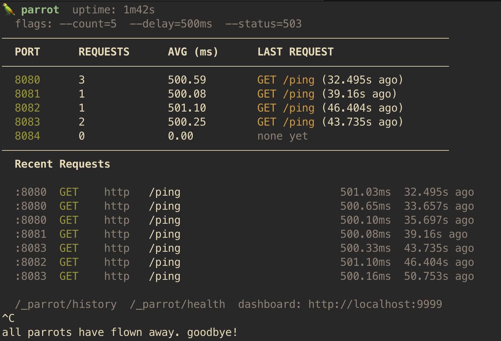
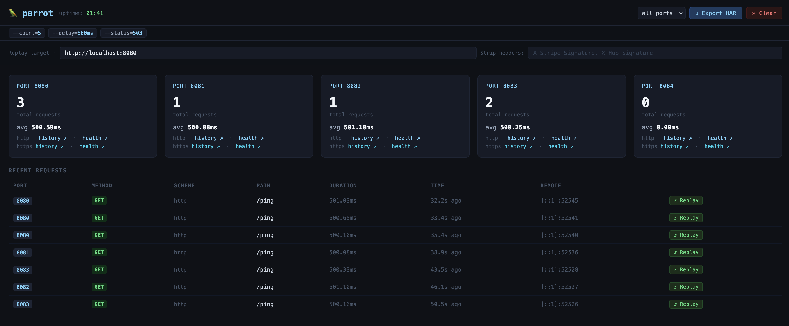

# 🦜 parrot

A lightweight HTTP echo & observability server written in Go. Launch a flock of parrots, each squawking back exactly what it receives — with a live terminal dashboard and web UI so you can see everything happening in real time.

## Features

- **HTTP echo** — every request returns a JSON mirror: method, path, headers, query params, body, timing, TLS flag
- **Live terminal dashboard** — per-port request counts, average latency, and a real-time request feed
- **Web dashboard** — browser UI at `localhost:9999` with colour-coded methods, per-port stats, and active flag display
- **Webhook replay** — re-send any captured request to a real endpoint with one command; strip time-sensitive headers like `X-Stripe-Signature`
- **HAR export** — standards-compliant HAR 1.2 via endpoint, dashboard button, or automatically on shutdown
- **Rate limiting simulation** — token bucket throttling with proper `429`, `Retry-After`, and `X-RateLimit-*` headers
- **TLS out of the box** — HTTP and HTTPS simultaneously; self-signed cert auto-generated, or bring your own
- **Multi-instance** — run N parrots on different ports from one command; useful for testing routing and load balancing
- **Integration test friendly** — `/_parrot/history` returns captured requests as JSON for programmatic assertion
- **Zero dependencies** — Go stdlib only, single binary, runs anywhere

---

## Why

You're building an HTTP client, configuring a reverse proxy, or wiring up webhooks. Something isn't working — but you can't tell whether the problem is in what you're *sending* or what you're *receiving*. You add logging, redeploy, trigger the request again, dig through output. Repeat.

Parrot short-circuits that loop. Point anything at it, and it immediately reflects back exactly what arrived — every header, the body, the timing, whether it came in over TLS — in structured JSON. A live terminal dashboard and browser UI show you everything in real time. No setup, no config files, no cloud dependency. Just run it.

---

## Who it's for

**Backend developers** debugging HTTP clients, SDKs, or service-to-service calls where you need to verify what's actually being sent — not what you think is being sent.

**Platform and infrastructure engineers** validating reverse proxy, load balancer, or API gateway configuration. Drop parrot behind nginx, Caddy, or an ALB and immediately see what headers it's injecting, rewriting, or stripping.

**Anyone working with webhooks** — Stripe, GitHub, Twilio, Shopify. Capture a real event once, then replay it against your local handler as many times as you need while you iterate. No triggering real payments or re-pushing to GitHub.

**QA and resilience testing** — simulate slow, rate-limited, or broken upstreams to verify your client's retry logic, backoff behaviour, and error handling without standing up a mock service.

---

## The core problem it solves

Most debugging tools show you what *your code* does. Parrot shows you what *actually crossed the wire*. That gap — between what you intended to send and what the network, proxy, or SDK actually sent — is where a surprising number of bugs live.

Common situations where parrot pays off immediately:

- *"Why is my auth failing?"* — check whether the `Authorization` header is actually being sent, and in what format
- *"What is nginx adding to my requests?"* — see the `X-Forwarded-For`, `X-Real-IP`, and any custom headers your proxy injects
- *"My webhook handler keeps breaking on retries"* — capture one real payload, replay it ten times, confirm idempotency
- *"Does my client handle 429s correctly?"* — enable rate limiting on parrot and watch what your client does when it gets throttled
- *"What did that webhook actually contain?"* — it arrived at 3am and caused a bug; the history is right there, exportable as a HAR file

---

## Requirements

- Go 1.21 or later
- No external dependencies

---

## Installation

```bash
git clone https://github.com/emotler/parrot
cd parrot
go build -o parrot .
```

Or run directly:

```bash
go run .
```

---

## Quick start

```bash
# Start with defaults — HTTP on :8080, HTTPS on :9080, dashboard on :9999
./parrot

# Send it something
curl http://localhost:8080/api/users?debug=true \
  -H "X-My-Header: hello" \
  -d '{"name":"alice"}'
```

Parrot echoes back exactly what it received:

```json
{
  "id": "a3f1c9e2b8d04751",
  "timestamp": "2026-02-21T10:00:00.123Z",
  "port": 8080,
  "tls": false,
  "method": "POST",
  "path": "/api/users",
  "query": { "debug": "true" },
  "headers": {
    "X-My-Header": "hello",
    "Content-Type": "application/x-www-form-urlencoded"
  },
  "body": "{\"name\":\"alice\"}",
  "body_bytes": 16,
  "remote_addr": "127.0.0.1:54321",
  "duration_ms": 0.42,
  "status_code": 200
}
```

Response headers include `X-Parrot-Port`, `X-Parrot-TLS`, and `X-Parrot-Duration-Ms`.

---

## Usage

```
parrot [flags]

Flags:
  -base-port  int           Starting port number (default 8080)
  -count      int           Number of parrot instances to launch (default 1)
  -ports      string        Comma-separated list of exact ports (overrides -base-port and -count)
  -history    int           Requests to keep in history per instance (default 100)
  -delay      duration      Artificial response delay, e.g. 200ms or 1s (default 0)
  -status     int           HTTP status code to respond with (default 200)
  -log-json   bool          Emit structured JSON logs (default false)
  -dashboard  int           Port for the web dashboard, 0 to disable (default 9999)

  -tls        bool          Enable HTTPS alongside HTTP (default true)
  -tls-offset int           TLS port = HTTP port + offset (default 1000, so :8080 → :9080)
  -tls-cert   string        Path to PEM certificate file (auto-generated if omitted)
  -tls-key    string        Path to PEM key file (auto-generated if omitted)

  -export-on-shutdown string  Write a HAR file to this path on Ctrl+C (e.g. ./session.har)
  -replay-timeout duration    Timeout for webhook replay requests (default 10s)
  -rate-limit float           Max requests/sec per instance, 0 = unlimited (e.g. 10, 0.5)
```

---

## Common recipes

**Inspect what your proxy is adding:**
```bash
./parrot
# Point nginx/Caddy/ALB at localhost:8080, send a request, read the headers back
```

**Simulate a slow, rate-limited upstream:**
```bash
./parrot -rate-limit 2 -delay 300ms -status 429
```

**Capture and replay a Stripe webhook:**
```bash
./parrot -export-on-shutdown ./session.har
# Trigger one real Stripe event, then:
ID=$(curl -s http://localhost:8080/_parrot/history | jq -r '.[-1].id')
curl -s http://localhost:8080/_parrot/replay \
  -X POST -H "Content-Type: application/json" \
  -d "{\"id\":\"$ID\",\"target\":\"http://localhost:3000/webhook\",\"strip_headers\":[\"X-Stripe-Signature\"]}"
```

**Test load balancer routing across multiple upstreams:**
```bash
./parrot -ports 8080,8081,8082
# Point your LB at all three, watch the dashboard to verify distribution
```

**CI-friendly, no terminal UI:**
```bash
./parrot -log-json -dashboard 0 -tls=false
```

**Assert what your client sent in an integration test:**
```bash
curl -s http://localhost:8080/_parrot/history | jq '[.[] | {method, path, headers}]'
```

---

## Built-in endpoints

Each parrot instance exposes these alongside the echo handler:

| Endpoint              | Method | Description                                     |
|-----------------------|--------|-------------------------------------------------|
| `/_parrot/history`    | GET    | Last N requests as a JSON array                 |
| `/_parrot/health`     | GET    | Status, port, TLS, and uptime                   |
| `/_parrot/export.har` | GET    | HAR 1.2 export (`?ports=all` for all instances) |
| `/_parrot/replay`     | POST   | Replay a captured request by ID                 |
| `/_parrot/clear`      | DELETE | Wipe history (`?ports=all` for all instances)   |

---

## Rate limiting simulation

Uses a token bucket — smooth limiting, not a blunt counter. The bucket refills at `--rate-limit` tokens/second, capped at one second's worth as the burst ceiling.

```bash
./parrot -rate-limit 5    # 5 req/s
./parrot -rate-limit 0.5  # 1 req per 2 seconds
```

When throttled, parrot returns:
```
HTTP/1.1 429 Too Many Requests
X-RateLimit-Limit: 5
X-RateLimit-Remaining: 0
Retry-After: 0.18
```

Combine with `--delay` to simulate a sluggish, rate-limited upstream.

---

## Webhook replay

Replay any captured request against a real endpoint — method, path, headers, and body preserved exactly.

```bash
ID=$(curl -s http://localhost:8080/_parrot/history | jq -r '.[-1].id')

curl -s http://localhost:8080/_parrot/replay \
  -X POST -H "Content-Type: application/json" \
  -d "{\"id\":\"$ID\",\"target\":\"http://localhost:3000/webhook\"}" | jq .
```

Strip headers that expire (Stripe signatures are valid for 5 minutes):
```bash
-d "{\"id\":\"$ID\",\"target\":\"...\",\"strip_headers\":[\"X-Stripe-Signature\"]}"
```

Every replay is tagged with `X-Parrot-Replay: true`, `X-Parrot-Replay-ID`, and `X-Parrot-Original-Timestamp` so your app can distinguish replays from live traffic.

Via the web dashboard: set a target URL in the replay bar, click **↺ Replay** on any row.

---

## HAR export

HAR files open in Chrome DevTools (Network tab → Import), Charles Proxy, Insomnia, and any HAR viewer.

Every request parrot receives can be exported as a [HAR 1.2](http://www.softwareishard.com/blog/har-12-spec/) file, ready to open in Chrome DevTools, Charles Proxy, or any HAR viewer.

**Via endpoint** — on any parrot instance:
```bash
# This port only (default)
curl http://localhost:8080/_parrot/export.har -o session.har

# All ports combined
curl "http://localhost:8080/_parrot/export.har?ports=all" -o session.har

# Specific ports
curl "http://localhost:8080/_parrot/export.har?ports=8080,8081" -o session.har
```

**Via web dashboard** — use the port selector and "⬇ Export HAR" button in the top-right corner.

**On shutdown** — capture the whole session automatically:
```bash
./parrot -export-on-shutdown ./session.har
# ... make requests ...
# Ctrl+C → writes session.har before exiting
```

---

## Examples

**Single parrot (default):**
```bash
./parrot
# → HTTP on :8080, HTTPS on :9080, web dashboard on :9999
```

**Five parrots on sequential ports:**
```bash
./parrot -base-port 3000 -count 5
# → HTTP :3000–:3004, HTTPS :4000–:4004
```

**Parrots on specific ports:**
```bash
./parrot -ports 8080,9090,7070
```

**Disable TLS:**
```bash
./parrot -tls=false
```

**Custom TLS offset (HTTP :8080 → HTTPS :8443):**
```bash
./parrot -tls-offset 363
```

**BYO certificate:**
```bash
./parrot -tls-cert ./cert.pem -tls-key ./key.pem
```

**Simulate a slow, failing service:**
```bash
./parrot -delay 500ms -status 503
```

**CI-friendly with JSON logs, no dashboard:**
```bash
./parrot -log-json -dashboard 0
```

---

## Echo Response

Every request to any path (HTTP or HTTPS) returns a JSON body showing you exactly what arrived. The `"tls"` field tells you which side it came in on:

```bash
# HTTP
curl http://localhost:8080/api/users

# HTTPS (self-signed, so -k to skip cert verification)
curl -k https://localhost:9080/api/users
```

```json
{
  "timestamp": "2026-02-21T10:00:00.123Z",
  "port": 9080,
  "tls": true,
  "method": "GET",
  "url": "/api/users",
  "path": "/api/users",
  "headers": { "User-Agent": "curl/8.4.0" },
  "body_bytes": 0,
  "remote_addr": "127.0.0.1:54321",
  "duration_ms": 0.42,
  "status_code": 200
}
```

Response headers include `X-Parrot-Port`, `X-Parrot-TLS`, and `X-Parrot-Duration-Ms`.

---

## Dashboards

### Terminal dashboard
Refreshes every 500ms in your terminal showing per-port request counts, average latency, and a live recent request feed.



### Web dashboard
Open `http://localhost:9999` in your browser for a real-time view with colour-coded methods, per-port stats cards, and a scrolling request table.



---

## Terminal Output

```
  _  _
 (o)(o)   parrot v2.0 — HTTP echo & observability server
  (  )
  /\/\

[parrot:8080] squawking on http://localhost:8080
[parrot:8081] squawking on http://localhost:8081
[parrot:8080] POST /api/users from 127.0.0.1:54321 — 0.42ms
[parrot:8081] GET /health from 127.0.0.1:54400 — 0.11ms
```

---

## License

MIT
